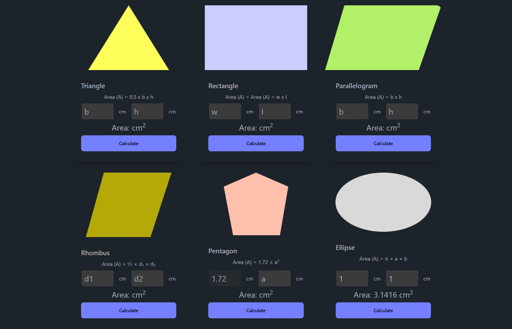

# 📐 Geometry Genius – Area Calculator

**Geometry Genius** is a responsive web tool that allows users to calculate the area of various 2D shapes including **ellipse**, **parallelogram**, **pentagon**, **rectangle**, **rhombus**, and **triangle**. This project is built using **HTML**, **Tailwind CSS**, **DaisyUI**, and **JavaScript**.

[🔗 Live Demo](https://devo-ab.github.io/geometry-genius)

---

## 🛠️ Tech Stack

- **HTML5**
- **Tailwind CSS**
- **DaisyUI**
- **JavaScript**

---

## 🌟 Features

- ✅ Area calculation for multiple shapes:
  - Ellipse
  - Parallelogram
  - Pentagon
  - Rectangle
  - Rhombus
  - Triangle
- 📲 Fully responsive for all devices
- 💡 Simple and intuitive UI
- 🧮 JavaScript-powered live calculations

---

---

## 📁 Folder Structure

```
geometry-genius/
├── assets/
│   ├── images/             # Website images
│   ├── logo/               # Logo files
├── preview/                # Screenshots for README
├── script/                 # JavaScript for area calculations
├── index.html              # Main landing page
└── README.md               # Project documentation
└── tailwind.config.js      # Tailwind config
```

---

## 🖼️ Screenshots

### 👣 Full page preview



---

## 📲 How to Use Locally

1. **Clone the repo**
   ```bash
   git clone https://github.com/devo-ab/geometry-genius.git
   cd geometry-genius
   ```

# 👤 Author

# Avi Jit

## :mailbox: Reach me out

<p align="left">
<a href="https://linkedin.com/in/itsavijitb" target="blank"></a>
<a href="https://twitter.com/itsavijitb" target="blank"></a>
<a href="https://facebook.com/itsavijitb" target="blank"></a>
<a href="https://instagram.com/itsavijitb" target="blank"></a>
</p>
